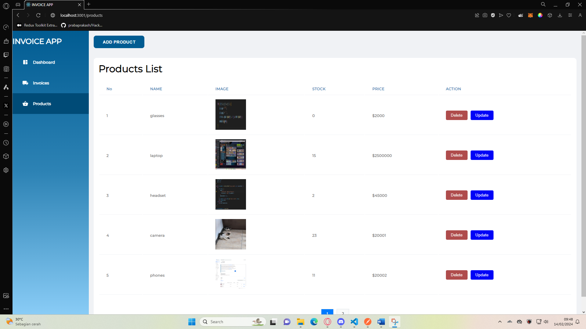
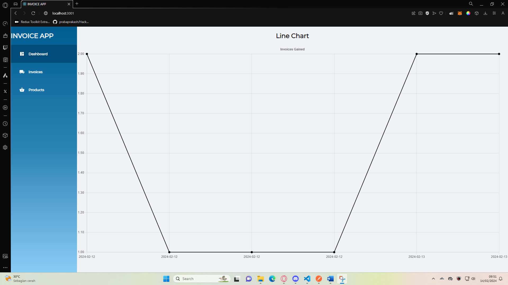

# widatech

Use npm start to run the server and it will run in port 3000 for the backend and port 3001 for the front end

Product List with pagination and the data store in postgre

Product List Page :

Add Product Modal :

Edit Product Modal :

Invoice List with pagination and the data store in postgres. 
When adding new invoice in product input page you can see the suggestion based on what you type
Invoice card show the data and total price of the product that customer bought

Invoice List Page :

Invoice Add Modal :

Invoice Card Page: 

Chart page using line chart to show the chart based on date and sold product

Chart Page :
